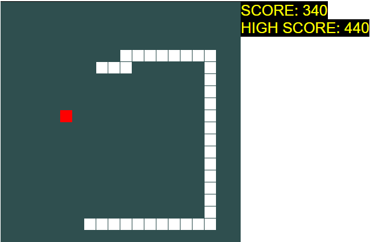

# Snake Game
## Um jogo da cobrinha com placar

#### Foi usado puramente JavaScript e um pouquinho de CSS e HTML.
#### Usei Classes em JS para representar a Cobra e para representar a Fruta.
#### O placar(SCORE) se atualiza dinamicamente cada vez que o usuário come uma Fruta.
#### A pontuação máxima(HIGH SCORE) fica salva no localStorage sempre que se atinge uma pontuação maior que a anterior.
### 

